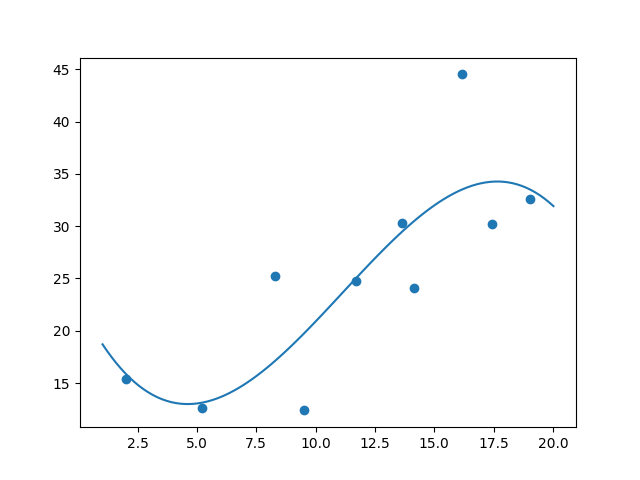
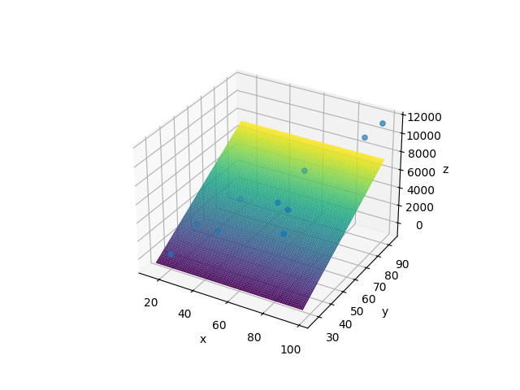
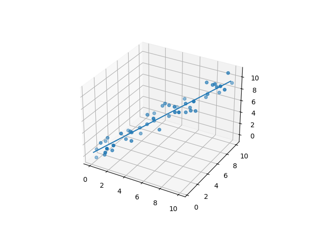

Polynomial regression implementation.  
Given a matrix $A\in\mathbb{R}^{n\times k}$ representing $n$ datapoints in $\mathbb{R}^k$, the goal is to perform a least-square method. The implementation returns a polynomial function of order $p$ (this can be a multi-variable function) that best fits the data.  
More formally, we have to find a polynomial function of order $p$: $F:\mathbb{R}^{k-m}\to\mathbb{R}^m$ that minimizes $\lVert F(a_1,a_2,...,a_{k-m})-(a_{k-m+1},a_{k-m+2},...,a_k)\rVert$, or $\lVert\sum_{d=0}^{p}\sum_{i\leq p}(c_ix_1^{i_1}x_2^{i_2}...x_{k-m}^{i_{k-m}})-(a_{k-m+1},a_{k-m+2},...,a_k)\rVert$. So the algorithm should find the parameters $c_0,c_1,...,c_l$, where $l=\sum_{d=0}^{p}\binom{d+(k-m)-1}{d}=\binom{p+k-m}{p}=$ the amount of terms in the sum.  
The implementation constructs a $n\times l$ matrix, say $S$, where $l$ is the quantity described above (the amount of coefficients in the function expression), and where $S_{ij}$ is one term of the function evaluated at the $i$-th datapoint in $A$ (so for example, if $p=2$, $k=3$ and $m=1$, then a row would look like  

evaluated at $x$ and $y$ at the first $k-m$, here 2, terms of the function at the $i$-th row of $A$. Let $B$ be the $l\times m$ matrix where the $i$-th column are the coefficients we have to find for the function $f_i$ (because $F=(f_1,f_2,...,f_m)$). We then have to solve for $c_0,c_1,...,c_l$:  
$$
SB = \begin{pmatrix}
a_{1,k-m+1} & a_{1,k-m+2} & \cdots & a_{1,k} \\
a_{2,k-m+1} & a_{2,k-m+2} & \cdots & a_{2,k} \\
\vdots      & \vdots      & \ddots & \vdots \\
a_{n,k-m+1} & a_{n,k-m+2} & \cdots & a_{n,k}
\end{pmatrix}
$$

The coefficients $c_0,c_1,...,c_l$ will then define the returned function.  
Examples of results:  
1. A best-fit polynomial of degree 3 for 10 datapoints in $\mathbb{R}^2$ looks like  

2. A best-fit linear multi-variable function for 10 datapoints in $\mathbb{R}^3$ looks like  

3. A best-fit parametric linear function for 10 datapoints in $\mathbb{R}^3$ looks like  

There are three functions implemented: one for the 2D-case, where a regular polynomial least-squares problem gets solved and a function $f:\mathbb{R}\to\mathbb{R}$ gets returned, a more general case where a function $f:\mathbb{R}^{k-1}\to\mathbb{R}$ gets returned and the most general case where a function $f:\mathbb{R}^{k-m}\to\mathbb{R}^m$ gets given.
